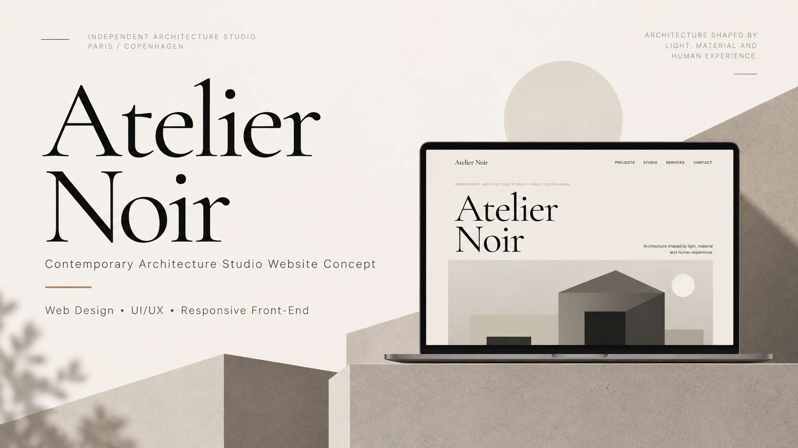
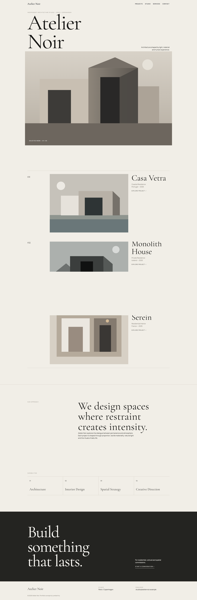
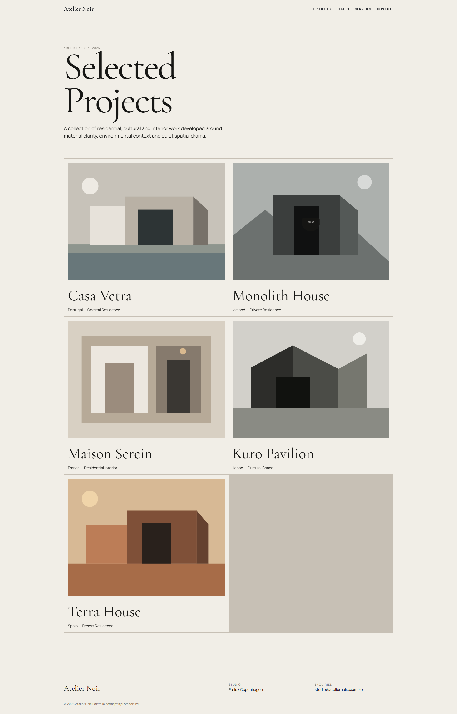
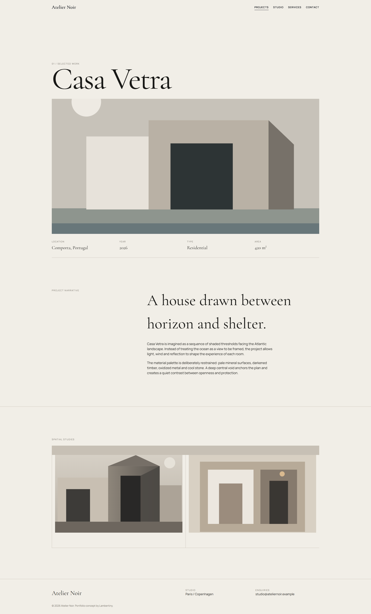
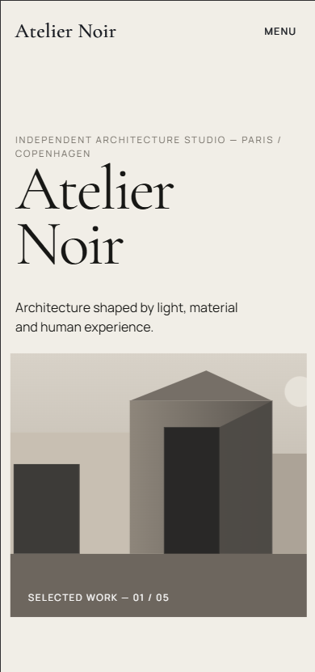
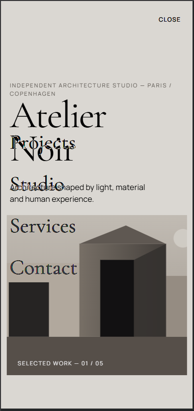
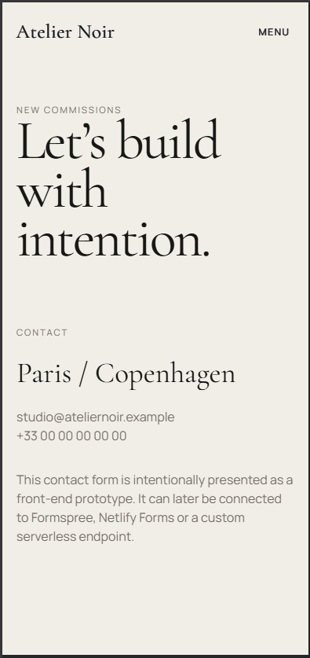

# Atelier Noir



A premium multi-page portfolio website concept for a fictional contemporary architecture studio.  
Designed to feel like a real client-facing digital experience rather than a generic front-end exercise.

[Live Demo](https://lambertiny.github.io/atelier-noir/) · [View Repository](https://github.com/Lambertiny/atelier-noir)

---

## Overview

**Atelier Noir** is a responsive editorial-style website created as a portfolio case study.  
The project explores a refined balance between **typography, space, composition, motion and architecture-led storytelling**.

The objective was to design and build a website that communicates the visual language of a contemporary architecture studio while also demonstrating strong front-end fundamentals and thoughtful UX decisions.

---

## Project Goals

- Create a portfolio project that feels like a **real professional studio website**
- Demonstrate skill in **web design, UI/UX and front-end development**
- Build a responsive multi-page experience with strong **desktop and mobile presentation**
- Use **motion and microinteractions** in a subtle, elegant way
- Keep the project lightweight, semantic and deployable via **GitHub Pages**

---

## Live Demo

**Website:**  
https://lambertiny.github.io/atelier-noir/

---

## Highlights

- Fully responsive multi-page website
- Editorial-inspired layouts with strong typographic hierarchy
- Refined desktop and mobile navigation
- Scroll-triggered reveal animations
- Subtle parallax and masked image reveals
- Direction-aware header behavior on scroll
- Cinematic page transitions
- Service cards and form microinteractions
- Semantic HTML structure
- Keyboard focus states for accessibility
- `prefers-reduced-motion` support
- Lightweight implementation with no framework dependency

---

## UX & Design Direction

The project was designed around a **contemporary editorial architecture aesthetic**.

### Visual principles
- Large serif display typography
- Minimal interface language
- Generous whitespace
- Calm visual rhythm
- Structured content hierarchy
- Sophisticated neutral color palette

### Experience goals
- Make the user feel they are visiting a **real premium design studio**
- Emphasize atmosphere and visual identity before technical complexity
- Maintain clarity and usability across all screen sizes
- Use motion only where it improves rhythm, orientation or emphasis

---

## Motion System

Motion was intentionally designed to feel **restrained and elegant**.

Included motion behaviors:
- Staggered mobile navigation reveal
- Scroll-based content entrance
- Mask reveal transitions for images
- Subtle parallax on selected visuals
- Header hide/show behavior based on scroll direction
- Smooth same-site page transitions

To preserve accessibility, motion-heavy interactions are reduced or simplified when the user has **reduced motion preferences** enabled.

---

## Pages

- `index.html` — Home
- `projects.html` — Project archive
- `project.html` — Featured case study
- `studio.html` — Studio profile
- `services.html` — Services and capabilities
- `contact.html` — Contact page

---

## Technologies Used

- **HTML5**
- **CSS3**
- **Vanilla JavaScript**
- **CSS Custom Properties**
- **CSS Grid**
- **Flexbox**
- **Intersection Observer API**
- **requestAnimationFrame**
- **GitHub Pages** for deployment

---

## Screenshots

### Desktop

#### Home


#### Projects


#### Project Case Study


---

### Mobile

<p align="center">
  
  
  
</p>
---

## Project Structure

```text
atelier-noir/
├── assets/
│   └── images/
├── css/
│   ├── reset.css
│   ├── variables.css
│   ├── global.css
│   ├── components.css
│   └── responsive.css
├── js/
│   ├── navigation.js
│   ├── main.js
│   └── animations.js
├── screenshots/
├── index.html
├── projects.html
├── project.html
├── studio.html
├── services.html
├── contact.html
├── LICENSE
└── README.md
